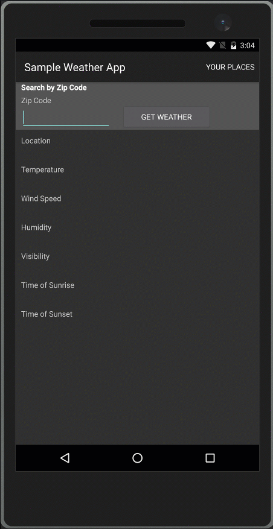
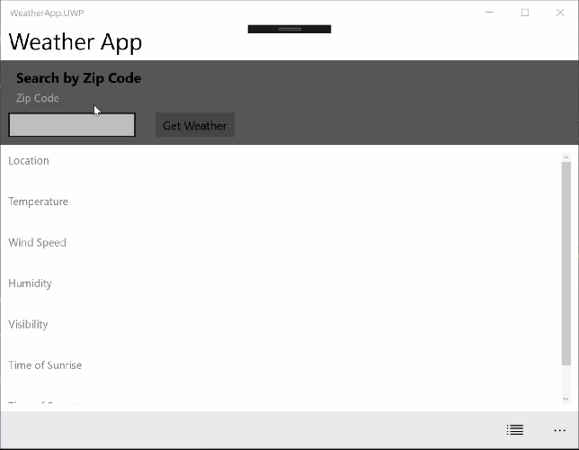

# Microsoft Build 2017 - Weather Sample - Xamarin.Forms Embedding (PREVIEW)
This sample shows a shared Xamarin.Forms UI being embedded into non-Xamarin.Forms iOS, Android and UWP applications. With this method developers can use as much or as little Xamarin.Forms in their application as desired.

The [HistoryPage.xaml](Weather/Weather.Forms/HistoryPage.xaml) demonstrates using an image and custom fonts across native applications.

Xamarin.Forms services such as DependencyService and MessagingCenter work with the exception of Navigation. Binding also works when setting the context. 

**NOTE:** This is an early preview and not all features have been evaluated.

[Watch the presentation](https://channel9.msdn.com/events/Build/2017/B8099) and [view the slides](https://sec.ch9.ms/sessions/c1f9c808-82bc-480a-a930-b340097f6cc1/build/2017/B8099.pptx) on Channel 9.

## Android


```
public void ShowHistory()
{
    if (_history == null)
    {
        // #1 Initialize Forms.Init(Context, Bundle)
        Forms.Init(this, null); 
        // #2 Use it with CreateFragment(Context)
        _history = new HistoryPage().CreateFragment(this);
    }


    // And push that fragment onto the stack
    FragmentTransaction ft = FragmentManager.BeginTransaction();

    ft.AddToBackStack(null);
    ft.Replace(Resource.Id.fragment_frame_layout, _history, "history");
    
    ft.Commit();
}
```

## iOS


Call `Forms.Init()` before creating the UIViewController.

```
public void ShowHistory()
{
    if (_history == null)
    {
        // #2 Use it
        _history = new HistoryPage().CreateViewController();
    }

    // And push it onto the navigation stack
    _navigation.PushViewController(_history, true);
}
```

## UWP Desktop


In this demo we placed the History Page inside a flyOut Frame. Call `Forms.Init(e)` prior.

```
var x = new HistoryPage().CreateFrameworkElement();
```